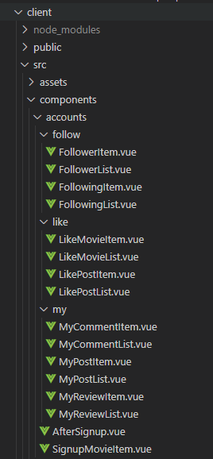
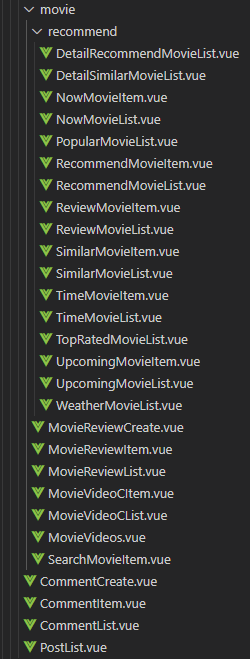
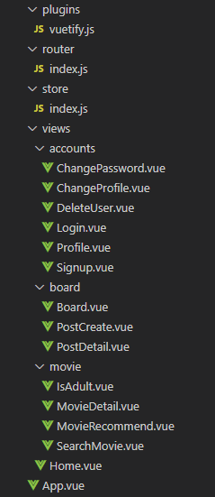
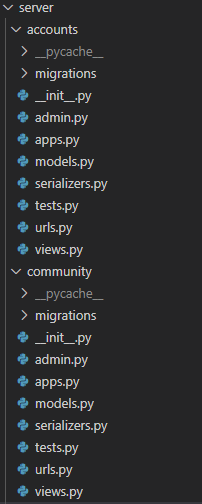
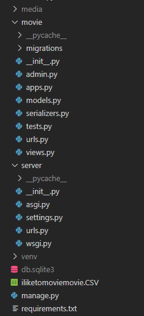
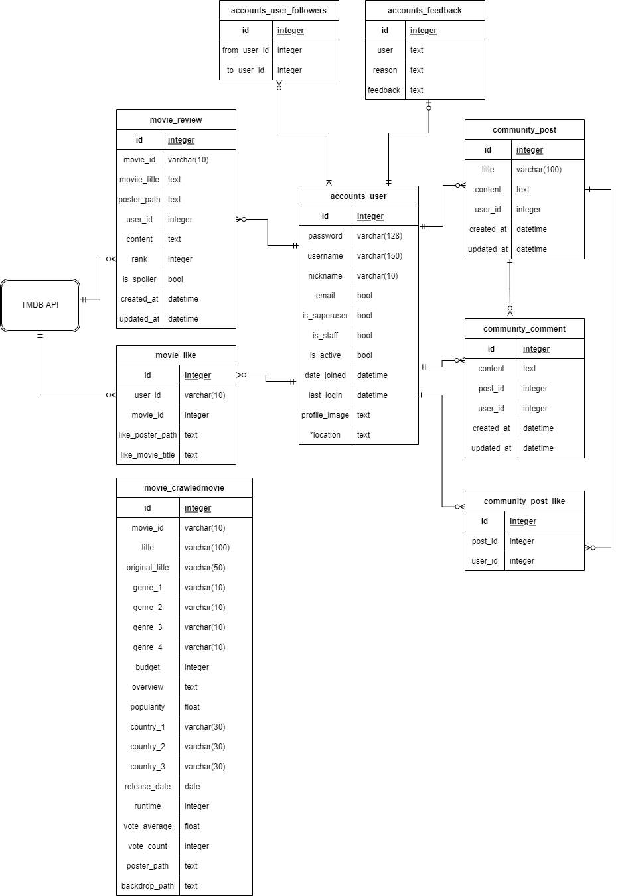
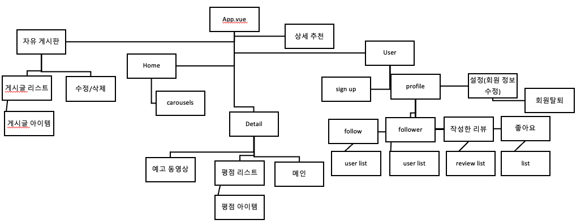
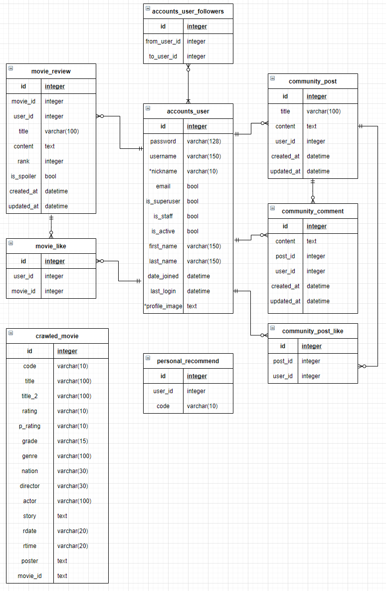
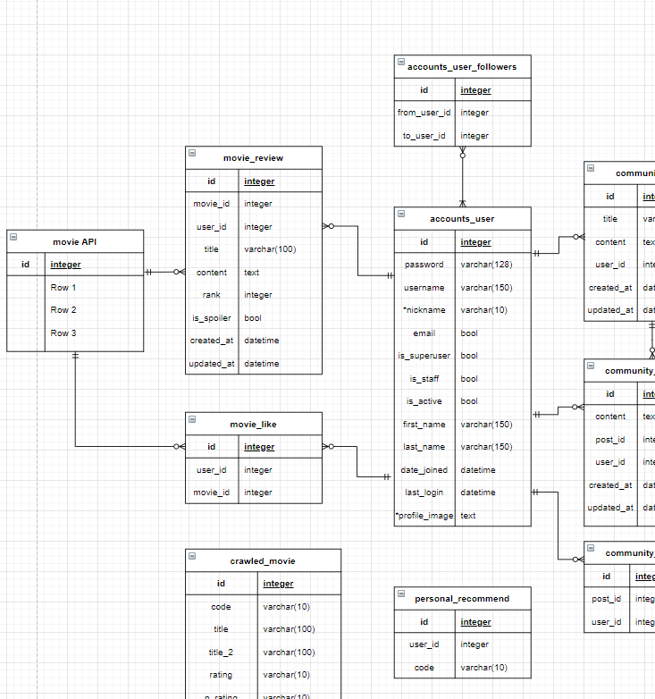

# PJT-Final

DJango REST API와 Vue.js를 활용한 영화 추천 및 커뮤니티 사이트


## "사이트이름"

Get What You Want 

- 영화 정보 또는 사용자가 원하는 그 이외의 모든 것들을 얻어가세요 ! 라는 의미


## 개발기간

- 2021.11.17 ~ 2021.11.25


## 팀원 

- **김지슬 (팀장)**
  - 프론트엔드
  - 프로젝트 전체 레이아웃 설계
  - API를 활용한 추천알고리즘 아이디어 구상
  - 영화 데이터 수집 코드 작성

- **장영남**
  - 백엔드
  - 사용자 리뷰기반 추천알고리즘 구상 및 구현
  - 데이터베이스 모델링(ERD)
  - 영화 데이터 수집 코드 작성


## 목표 설정

- 영화 정보 기반 추천 서비스 구성
- 커뮤니티 서비스 구성
- HTML, CSS, JavaScript, Vue.js, Django, REST API, DataBase 등을 활용한 실제 서비스 설계
- 서비스 관리 및 유지보수가 용이하도록 설계할 것
- 사용자의 입장에서 생각하여 이용하기 편리하도록 UI 구성
- 사용자가 어떻게하면 많이 이용할 수 있을지를 고민
  - 획기적인 테마, 엄청난 추천 알고리즘도 중요하지만, 이용하기 불편한 점을 만들지 않는 것이 더 중요하다고 생각했음


##  설치

- python

```bash
$ python -m venv venv
$ source venv/Scripts/activate
$ pip install -r requirements.txt
$ python manage.py migrate
$ python manage.py runserver
```

- vue

```bash
$ npm i
$ npm run serve
```


## 프로젝트 구조

#### Vue.js

- 최상위 컴포넌트인 App.vue 내부에 vuex의 라우터로 `accounts` , `movie`, `board` 앱을 분리하여 views폴더에 관리하였으며 나머지 파일들은 components폴더에 앱과 역할에 따라 폴더로 구분하여 관리하였습니다.








#### DJango REST API

- server 프로젝트 내부에 `accounts`, `community`, `movie` 앱을 생성하였습니다.






## ERD



- accounts_user 모델 중심으로 ERD를 구성.
- user 모델은 자기자신을 M:N 참조하여 팔로우 팔로잉 기능을 구현.
-  feedback 모델은 회원 탈퇴하는 유저가 남기는 피드백을 보관하여 관리자가 확인할 수 있도록 함.
- community의 주 모델은 post, comment이며 post_like 모델은 유저와 게시글이 M:N 참조 관계를 갖도록 하는 중개모델이다.
- 영화정보는 TMDB의 API로 불러온다. 이 정보들은 DB에 직접 저장되어 있지 않으므로 M:N관계를 movie_id 필드를 만들어서 구현.
- crawledmovie는 초기에 네이버 영화에서 크롤링한 영화 데이터들을 이용하려고 했으나, 크롤링 코드를 개조하여 TMDB API로 영화데이터들(약 7000개)을 받아와서 DB에 저장하였다.
  - 이 데이터들은 리뷰 기반 추천 알고리즘에 쓰임.


# PJT 기능 및 구현 내용 소개 

### 1. 서버구조

- server(프로젝트)
- account(계정 관련 앱)
- community(게시판 관련 앱)
- movie(영화 서비스 관련 앱)


### 2. API 활용

- ##### 영화를 클릭하면 영화의 상세정보(제목 줄거리 등)을 볼 수 있도록 함

- ##### 홈에서 현재 상영중인 영화와 개봉예정인 영화들 목록 제공

- ##### 영화 검색
  - API와 장고 ORM을 활용하여 영화 제목에 검색한 단어가 포함되는 영화들을 client로 전달해줌


#### 추천 알고리즘

- ##### TMDB API 활용

  - 한 영화에 기반한 추천 영화들 추천

  - 한 영화의 장르와 키워드에 기반한 비슷한 영화들 추천

  - 인기 영화 추천

  - 평점 높은 영화 추천

  - ##### 오늘의 날씨에 기반한 영화 추천

    - Geolocation API를 이용, 현재 위치(위도, 경도)를 사용자로부터 받아서 openweathermap API로 그 지역의 날씨를 알아 낸 후, 해당 날씨에 어울리는 장르를 설정하여 TMDB API로 영화를 받아오도록 함.

  - 현재 시간대 어울리는 영화 추천

  - ##### 사용자가 남긴 리뷰의 평점을 반영하여 영화를 추천

    - BOJ 15957번 문제와 계층적 군집화(HC) 알고리즘에서 영감을 받아  리뷰기반 추천 알고리즘 구현
    
    

### 3. 네비게이션 바

- HOME, BOARD, RECOMMEND, 
- 영화 검색창
- 프로필사진
  - 프로필 사진을 클릭시 MY PROFILE, SETTING, LOGOUT 드롭다운으로 활성화 되며 관리자 계정일시 관리자 페이지로 이동 가능한 버튼이 추가로 활성화 된다.


### 4. 회원가입

- #### 회원가입은 3가지의 단계를 거친다.

  - ##### 1단계: 유저정보 입력

    - < ID, 닉네임, 패스워드, 패스워드확인, email >을 입력후 sign up 버튼을 누르면 다음 단계로 이동.
    - 유효성 검사를 통과하지 못하면 sign up 버튼 비활성화, 모두 올바르게 입력하면 자동으로 활성화 된다.

  - ##### 2단계: 관심장르 입력

    - 관심 장르를 2개이상 고르면 다음 단계로 진행 가능

  - ##### 3단계: 좋아하는 영화 고르기

    - 2단계에서 고른 장르별로 추천영화가 5개씩 화면에 보여지며 좋아하는 영화를 고르면 해당 영화를 "좋아요"하게 된 것으로 처리되어 프로필에서 확인 가능하다.
    - 이 과정은 좋아요한 영화를 기반으로 영화 추천 목록에 반영되도록 하기 위함이다.


### 5. 회원탈퇴

- ##### 비밀번호 확인

  - 비밀번호 확인을 통해 인증이 된 후에 탈퇴가 가능하도록 함

- ##### 피드백 받기

  - 탈퇴사유를 feedback 모델에 저장해 관리자가 확인하고 사이트를 개선하는데 도움이 될 수 있도록 함.

- ##### 회원탈퇴시 해당 유저의 기록들 삭제

  - 모델에 유저를 참조하는 다른 모델의 속성에 `on_delete=models.CASCADE` 속성을 추가하여 해당유저가 남긴 모든 기록을 삭제하도록 함
  
  

### 6. 유저 프로필 구성

- ##### FOLLOW 

  - 해당 프로필의 유저와 팔로우, 언팔로우 관계 맺기 가능
  - 나를 팔로우한 유저들, 내가 팔로우한 유저들 목록, 팔로우 수, 팔로워 수 제공
    - 팔로우, 팔로워 유저를 클릭하여 해당 유저 프로필로 이동
  - 내 팔로워의 팔로우 끊기
    - 상대방의 팔로잉 목록에서도 내가 사라지게 된다. 

- ##### LIKE

  - 내가 좋아요한 영화, 좋아요한 게시글 목록 제공
    -  클릭하여 해당 영화, 게시글의 detail로 이동

- ##### HISTORY

  - 내가 남긴 리뷰, 게시글, 댓글의 목록 제공
    - 클릭하여 해당 리뷰, 게시글로 이동


### 7. 회원 정보 수정

- 회원정보 수정 창에서 < 닉네임, email, 프로필 이미지, 비밀번호 >를 바꿀 수 있도록 함
  - 프로필 이미지는 회원가입시 기본이미지로 주어지며 유저가 원할 경우 이미지 파일을 업로드하여 프로필 이미지를 바꿀 수 있다. 
  - 유저가 올린 이미지 파일은 django 서버의 미디어루트에 저장되며 회원 탈퇴시 해당 회원이 올린 이미지 파일들도 삭제하도록 모델의 delete 메서드를 오버라이드함.

### 8. HOME

- Carousel을 이용하여 사이트의 공지, 이벤트 등을 볼 수 있도록 함.
- 현재 상영중인 영화와 개봉예정인 영화들의 목록을 볼 수 있음 (TMDB API 활용)


### 9. BOARD(게시판 커뮤니티)

- 유저들이 자유롭게 글을 작성 할 수 있는 커뮤니티
- 게시글 작성시 내가 작성한 게시글의 detail로 이동
- 페이지네이션을 이용, 10개의 게시글 단위로 페이지 이동 가능
- 게시글의 제목을 검색하여 게시글을 찾을 수 있도록 함(Django ORM 활용)
- 게시글을 클릭하여 게시글의 상세 내용을 확인 할 수 있음
  - 자신이 작성한 게시글은 수정, 삭제 가능
  - 게시글에 좋아요를 남기고 프로필에서 확인 가능
  - 댓글
    - 게시글을 참조하여 1:N 관계를 가지며 내가 쓴 댓글은 프로필에서 확인 가능
    - 댓글의 유저를 클릭해 해당 유저의 프로필로 이동 가능


### 10. RECOMMEND

- 추천 영화의 목록들을 제공

  - POPULAR MOVIE

    - TMDB API 이용, 인기있는 영화 TOP 20의 목록을 보여줌

  - SIMILAR MOVIE

    - TMDB API 이용, 한 영화(movie_id)와 비슷한 영화들(장르, 키워드기준) 목록 제공

  - TOP RATED MOVIE

    - TMDB API 이용, 평점이 높은 영화  TOP 20의 목록을 보여줌

  - RECOMMENDED BY YOUR LIKES

    - TMDB API 이용, 유저가 좋아요를 누른 영화중 하나를 골라 그 영화에 기반한 추천영화 목록 제공

  - SIMILAR TO YOUR LIKES

    - TMDB API 이용, 유저가 좋아요를 누른 영화중 하나를 골라 그 영화에 기반한 비슷한 영화 목록 제공

  - ##### RECOMMENDED BY TODAY'S WEATHER

    - geolocation API와 openweathermap API, TMDB API를 이용하여 현재위치의 날씨에 기반한 추천영화 목록 제공

  - SUITABLE FOR THIS TIME

    - TMDB API 이용, 현재 시간대에 어울리는 장르를 설정하고 그 장르에 관련한 추천 영화목록 제공
  
  - ##### RECOMMENDED BY YOUR REVIEW
  
    - 내가 작성한 리뷰의 평점을 반영하여 영화의 장르, 제작국가의 선호도 가중치 매겨서 추천영화 목록을 제공


### 11. MOVIE DETAIL

- 홈, 추천페이지, 프로필, 영화검색 등에서 보여지는 영화를 클릭시 해당 영화의 디테일 페이지로 이동
- 영화의 디테일 페이지에서는 해당 영화의 장르, 줄거리, 개봉날짜 등을 포함한 상세정보와 Youtube API를 이용한 해당 영화의 예고편 메인으로 보여주는 동시에 다른 관련 영상들도 목록으로 제공해준다.
- 해당 영화와 관련한 다른 추천영화들, 비슷한 장르, 키워드의 영화들 목록을 제공해준다.
- 영화를 좋아요해서 프로필에서 확인 가능하도록 함.
- 해당 영화의 리뷰를 남길 수 있다.
  - 리뷰를 남길 때 1~5점 사이의 평점을 반영 할 수 있다.
  - 남긴 리뷰는 프로필 페이지에서 확인 가능하며 내가 준 평점은 리뷰관련 영화추천 알고리즘에 쓰인다.
  - 리뷰를 남길 떄 스포일러가 포함된 내용 체크박스에 체크하여 스포일러를 원하지 않는 유저들은 클릭하기 전까진 해당 리뷰가 보이지 않도록 설정 함
- 성인영화는 접근하지 못하도록 막음.


### 12. 관리자 페이지

- 관리자 페이지에서 관리자가 모든 유저, 게시글, 댓글, 리뷰, 좋아요한 영화, 좋아요한 게시글 회원 탈퇴 피드백, 수집한 영화 데이터를 등록 / 수정 / 삭제 가능.
- 관리자로 로그인 했을 시만 프로필 메뉴에 admin 페이지로 가는 버튼이 활성화 된다.


# 느낀점

- ##### 소통의 중요성

  - 백과 프론트를 나눠서 프로젝트를 진행하긴 했지만 백은 프론트를, 프론트는 백을 잘 이해하고 있어야 원활한 데이터의 전달이 가능하다는 걸 느꼈습니다. 
  - 프론트가 어떠한 데이터를 넘겨주면 백은 그 데이터를 가지고 특정 로직을 수행 한 후 프론트가 원하는 데이터로 정제하여 올바르게 보내줘야 그 기능이 올바르게 구현된다는 것을 프로젝트를 진행하면서 많이 느끼게 되었습니다.

- ##### 시작단계에서 체계를 잡는것의 중요성

  - 프로젝트의 시작 전에 회의를 해서 앞으로 어떤 방향으로 진행할지에 전반적인 체계를 잡고 시작하였습니다.
  - 회의를 할때 필수로 넣어야 하는 기능과 추가로 넣으면 좋을 기능들을 브레인스토밍하여 분리하였고 프로젝트 기간동안 우선순위를 두고 구현해야 되는 것을 구분하여 진행하였습니다. 그 결과 필수로 넣어야 하는 기능과 명세는 모두 구현하였고 추가적으로 구현하기로 생각했던 것들은 모두 하진 못했지만 일부분은 추가로 구현하여 사이트의 완성도를 높였습니다.

- ##### 커밋의 중요성

  - 저희조는 철저한 바텀업 방식으로 프로젝트를 진행하였습니다. 백과 프론트 동시간대에 같은 기능을 구현하면서 소통하며 한 기능이 완성되면 commit merge하여 제대로 동작하는 확인하는 절차를 거치고 오류가 발생하면 그때 그때 이유를 찾아 고칠 수 있었습니다.

- ##### 프론트가 할일이 많구나

  - 기능을 구현하는 일들은 최대한 백에서 맡긴 하였지만 프론트는 받은 데이터를 DOM에 잘 반영시키는 일 뿐만아니라 페이지를 꾸미는 일까지 하다보니 할일이 정말 많았다. 그래서 백에서 할일을 최대한 빨리 끝내고 같이 프론트에 붙어서 짜잘한 스타일링을 도와주었습니다. 프론트가 정말로 할일이 많다는걸 느끼게 되었습니다.

- ##### 우리는 드림팀이다

  - 팀원이 서로의 장단점에 맞춰 프론트와 백을 나누었고 그결과 각자의 강점을 잘 활용하여 프로젝트를 수월히 진행할 수 있었습니다.
  - 프로젝트 시작할때 진행하면서 혹시 의견충돌이 나거나 싸우진 않을까 걱정했지만  그런 걱정이 무색해질큼 재미있게 진행하였습니다. 
  - 프로젝트 기간동안 매일 아침부터 새벽까지 프로젝트에 몰두하여 피곤함이 쌓였지만 서로 응원하며 끝까지 최선을 다해 프로젝트를 마칠 수 있었습니다.


## 날짜별 진행 상황

#### 11월 15일 월

- 기획 및 페이지 구성 회의
- 네이버 크롤링 코드 작성 


#### 11월 16일 화 

- 네이버 크롤링 완료 

- tmdb 크롤링 코드 완성

  - 추천 알고리즘에 사용하기 위함 

- vue 구조 1차

  

- ERD 구조 1차 

  


#### 11월 17일 수요일 



- tmdb 크롤링 완료

- 프로젝트 생성
- 프론트엔드
  - 게시글 목록, 게시글 상세 조회, 게시글 작성
  - 회원가입, 로그인, 로그아웃
- 백엔드 
  - 자유게시판 CRUD, 댓글 CRUD, 
  - 회원가입, 로그인, 로그아웃


#### 11월 18일 목요일 

- 프론트엔드 
  - 자유게시판 CRUD 서버에서 가져오고 넘기기
  - 댓글 CRUD
  - profile 설계 
- 백엔드 
  - serializer 수정 (게시글 - 댓글까지 한번에 넘기기)
  - 게시판 R / UD 요청 분리
  - 팔로잉 팔로워
  - 게시글 좋아요
  - 프로필
    - 요청시 팔로잉, 팔로워, 좋아요, 활동내용까지 다 넘겨주기


#### 11월 19일 금요일

- 프론트엔드
  - 유저 profile
  - 영화 디테일 / 추천 구조
- 백엔드
  - movie app 만들기, 영화 디테일, 리뷰, 좋아요 등 
  - api 사용하여 주제에 맞는 영화 데이터 넘겨주기 


#### 11월 20일 토요일

- 프론트엔드
  - 부족한 구조 끝내기 
  - css 시작 
- 백엔드
  - community app url 수정, 추가
  - 회원탈퇴, 게시글 검색, 회원정보 수정 추가
  - 디버깅
  - 모델수정
  - 관리자 페이지 추가


#### 11월 21일 일요일

- 프론트엔드
  - css
  - 오류 수정 
- 백엔드
  - 추천 알고리즘 구현 


#### 11월 22일 월요일 ~ 24일 수요일

- 추가 기능
- 디버깅
- 프론트 스타일링
- README 정리


#### 11월 25일 목

- 스타일링 및 최종 디버깅
- 발표 ppt 제작
- 프로젝트 제출


